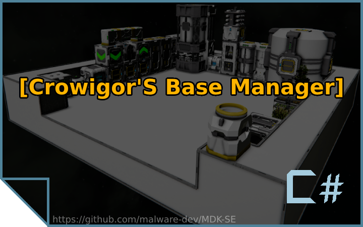

# Crowigor's Base Manager

## Script Description
The script is a set of useful functions for automating database management.

## Inventory Manager
The function searches for items in all available blocks and transfers them to the specified containers.

## Cleaning up Assemblers' Inventories
The function periodically completely clears the resource inventory of assemblers by transferring the contents to containers associated with these items.

## Items Assembling
The function periodically checks the number of specified items and if the number of items (including production queues) is less than the specified number, it adds the item to production.

## Items Disassembling
The function periodically checks the number of specified items and if the number of items (including disassembly queues) is greater than the specified quantity, it adds the item to production and dismantles it. Additionally, the function checks the assembler's queue and transfers the required items to the inventory.

## Stopping Drones
The function checks the fullness of the containers specified in the connector settings and if the percentage of their filling is greater than the specified one (90% by default), it turns off the block specified in the settings.

## Guide
A full description of the functions, as well as instructions for their use, can be viewed in the manual:
- [English Guide](https://steamcommunity.com/sharedfiles/filedetails/?id=3119211195)
- [Russian Guide](https://steamcommunity.com/sharedfiles/filedetails/?id=3030970526)

## Languages
Initially, the script was written with RU localization in mind; all item names were taken from the game files. Additionally, the script supports the ability to specify the names of objects in EN.

## Mod Support
- [Paint Gun](https://steamcommunity.com/sharedfiles/filedetails/?id=500818376)
- [Eat. Drink. Sleep. Repeat!](https://steamcommunity.com/sharedfiles/filedetails/?id=2547246713)
- [Plant and Cook](https://steamcommunity.com/sharedfiles/filedetails/?id=2570427696)
- [AiEnabled](https://steamcommunity.com/sharedfiles/filedetails/?id=2596208372)
- [Personal Shield Generators](https://steamcommunity.com/sharedfiles/filedetails/?id=1330335279)

## Developed Using MDK-SE
This script was developed using [MDK-SE](https://github.com/malware-dev/MDK-SE/).